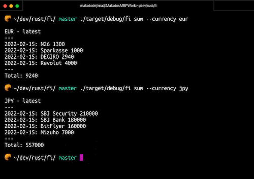
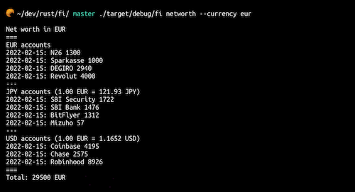

## fi

Cli for personal finance

```
$ fi pull
```
Pulling data from Notion tables

```
$ fi history [--currency | -c] <currency>
```


```
$ fi sum [--currency | -c] <currency>
```


```
$ fi networth [--currency | -c] <currency>
```


…and more.

```
USAGE:
    fi <SUBCOMMAND>

FLAGS:
    -h, --help       Prints help information
    -V, --version    Prints version information

SUBCOMMANDS:
    delete      Delete all table rows
    help        Prints this message or the help of the given subcommand(s)
    history     Display history of accounts
    networth    Display net worth in given currency
    pull        Pull account and snapshot data from notion table
    sum         Display latest sum for given currency
```

If you:

- feel like keeping track of your personal finances in Notion
- are weird enough that you want to use cli to view the data
- don't mind setting up free Postgres DB on Heroku
  you can use it too.

I am hosting "Notion API Worker" myself using Cloudflare, on order to access Notion table data from cli. (https://notion-api.mkd.workers.dev).
This is a neat tool that allows you to access your Notion content, created by [these nice people](https://github.com/splitbee/notion-api-worker)
See the [documentation](https://github.com/splitbee/notion-api-worker) for how to set the token for private pages. For public pages there's no need for authorization.
